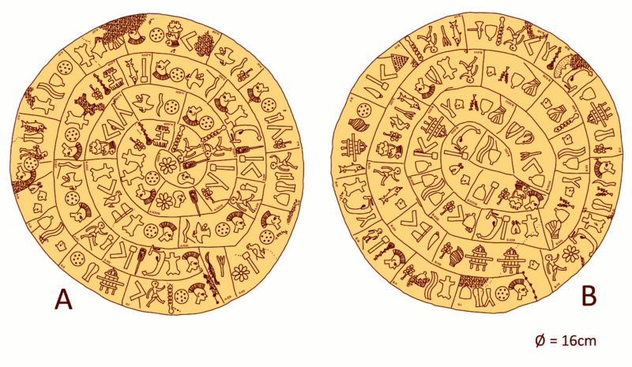

# Phaistos Disc

> A library of Python utilities to aid in the decipherment of the Phaistos disc



Since 1908[^1], the Phaistos disc has eluded decipherment, despite widespread interest and several recent computer-aided analyses[^2]. The utilities provided in this library aim to assist in the analysis and decipherment of the Phaistos disc by providing a suite of tools and databases, and by documenting progress made by means of computational or analytical advancements.

Datasets are currently limited to various transcriptions of the disc, and will eventually include word lists from known ancient Mediterranean languages.

Some research materials are included in [/biblio/](./biblio)

## Usage

### Basic text formatting

```python
# Print the disc with line+word numbering
from phaistos_disc.util import format_disc

print(format_disc("inside_out"))

A1 𐇵 𐇒 𐇙
A2 𐇐 𐇜
A3 𐇤 𐇴 𐇲 𐇪 𐇪 𐇛 𐇑
…

# Print the disc with line separators
print(format_disc(
   "inside_out", letter_separator="-", word_separator="|", prefix=False,
))
𐇵-𐇒-𐇙|𐇐-𐇜|𐇤-𐇴-𐇲-𐇪-𐇪-𐇛-𐇑|𐇵-𐇒-𐇙|…
```

### Transcription

As an example of the potential utility of the tool, I've included Achterberg's transcriptional mapping[^3] of phonetic values to their hieroglyphic forms in [](./src/data/phaistos-disc_signs-achterberg.csv), which can be used as shown below:

```python
# based on Achterberg 2021, _The Phaistos Disc: A Luwian Letter to Nestor_
achterberg_transcription = format_disc(
   "outside_in",
   sign_map=get_sign_map(data_fp / "phaistos-disc_signs-achterberg.csv"),
   output_type=OutputType.phoneme,
   letter_separator="-",
   word_separator="\n",
   prefix=True,
)
print(achterberg_transcription)

A1 á-tu-mi1-SARU-s6-ti
A2 pa-ya-tu
A3 u-ná-sa2-ti
A4 u-u-ri
A5 á-tu-hi-ya-wa8
…
```

### Install

1. Download the library, either by pip installing it, or cloning this repo

1.a) pip install phaistos-disc

Or for contributors, fork or clone the repo

1.b) git clone https://github.com/hp4k1h5/phaistos-disc.git

phaistos-disc uses [`uv`](https://docs.astral.sh/uv/) to structure and manage the project.

- [Install `uv`](https://docs.astral.sh/uv/getting-started/installation/)
- `cd` into the project with e.g. `cd path/to/phaistos-disc`
- Create a virtual environment: `uv venv`
- Create a venv shell: `source .venv/bin/active`
- Install dependencies: `uv install`

## Contributions

Contributions are welcome. Fork the repo, follow the installation instructions above, and submit a pull review with your edits.

## Bibliography

[^1]: Evans, Arthur. 1952. _Scripta Minoa, the Written Documents of Minoan Crete, with Special Reference to the Archives of Knossos._ Oxford: Clarendon Press.

[^2]: Braović, Maja, Damir Krstinić, Maja Štula, and Antonia Ivanda. 2024. “A Systematic Review of Computational Approaches to Deciphering Bronze Age Aegean and Cypriot Scripts.” Computational Linguistics 50 (2): 725–79. https://doi.org/10.1162/coli_a_00514.

[^3]: Achterberg, Winfried. 2021. “The Phaistos Disc : A Luwian Letter to Nestor.” The Phaistos Disc : A Luwian Letter to Nestor, January. https://www.academia.edu/66972374/The_Phaistos_disc_a_Luwian_letter_to_Nestor.
